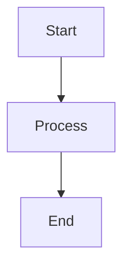

# 05. 프로젝트 표준 템플릿 (Template)

본 문서는 `CLI_Tutor` 프로젝트 내에서 생성되는 모든 아이템(Items)과 문서를 위한 표준 규격입니다. `entries/` 또는 기타 문서 폴더에 새로운 문서를 생성할 때 본 템플릿을 복사하여 사용하십시오.

## [문서 제목 / 아이템 명]

- **작성일**: 2026-00-00
- **작성자**: Anti & System Agent
- **태그**: #Tag1, #Tag2
- **상태**: Draft / In-Progress / Completed

---

## 1. 개요 (Background)
> 이 아이템이나 기능이 왜 필요한가? 프로토타입에서 어떠한 문제 의식을 가지고 도출되었는가?

## 2. 상세 설계 (Detailed Design)
> 구체적인 로직, 흐름, 기술적 구현 방안을 작성

### 2.1 주요 기능 (Key Features)
- Feature A
- Feature B

### 2.2 아키텍처 / 흐름도 (Architecture/Flow)

## 3. 기대 효과 및 고려 사항 (Impact & Considerations)
> - 도입 시 장점
> - 잠재적 문제점, 기술적 한계 (OS 호환성 등)

## 4. 실행 계획 (Action Plan)
- [ ] Task 1
- [ ] Task 2

---
> [!TIP]
> 기본 설계를 충실히 작성하여 엄격한 규격을 준수하고, 개발 구현 단계에서의 혼선을 최소화하십시오.
