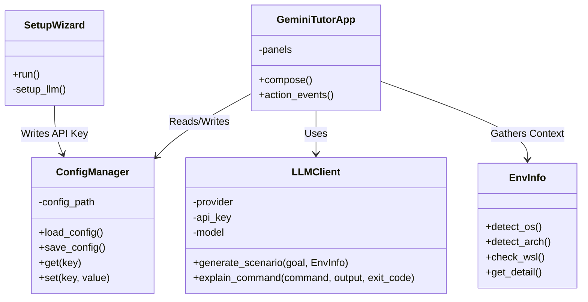

# 03. 핵심 기술 아키텍처 (Technical Architecture)

- **작성일**: 2026-03-10
- **작성자**: Anti & System Agent
- **태그**: #Architecture, #TechStack, #TUI
- **상태**: Draft

---

## 1. 개요 (Background)
CLI Tutor 프로젝트가 원활한 사용자 경험을 제공하면서도 동시에 높은 확장성을 가지기 위해 샘플 프로토타입에 기반한 코어 엔진 및 유닛 설계를 캡슐화합니다.

## 2. 상세 설계 (Detailed Design)

### 2.1 스택 및 라이브러리 선정
- **개발 언어:** `Python 3.8+` (가장 많은 터미널/스크립트 사용자층 보유)
- **UI 프레임워크:** `Textual` (이벤트 루프 지원, 비동기 TUI) + `Rich` (문자열 스타일링)
- **네트워크 / I/O:** `httpx` (비동기 처리), 표준 `subprocess` 및 향후 `pty` / `winpty` (터미널 스트림 하이재킹)
- **LLM 클라이언트:** `groq`, `perplexity-python`, `google-generativeai`

### 2.2 핵심 클래스 설계 (Class Architecture)

### 2.3 시스템 작동 패러다임 (System Paradigm)

1. **상태 분리 (State Separation):** 로컬 환경 상태(`EnvInfo`), 영속적 저장 설정(`ConfigManager`), 일회성 세션 상태는 철저히 분리하여 결합도를 낮춤.
2. **Provider 패턴 (LLM Client):** 단일 AI 모델 종속을 막기 위해 추상화 레이어를 둠. `provider_type` 인자에 따라 `_generate_groq`, `_generate_perplexity` 등으로 분기. (향후 Local LLM 모듈 추가가 매우 쉬움)

## 3. 기대 효과 및 고려 사항 (Impact & Considerations)
- 향후 "CLI 명령어 스트림 실시간 캡처" 기능 추가가 가장 큰 기술적 허들이 될 것입니다. (단순 `subprocess.run`은 인터랙티브 명령어 처리(ex. vim, nano, htop 등)에 치명적인 한계가 있음).
- 이 부분은 `Textual`의 터미널 위젯과 로컬 셸 간의 PTY/WinPTY 통신 연결 기술 연구 카드로 분리하여 고도화가 필요.
