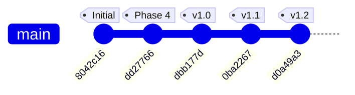

# CLI Tutor 개발 이력 (Git Graph)

본 프로젝트의 커밋 이력과 마일스톤을 Mermaid Git Graph로 시각화한 문서입니다.

## 📈 Git Flow 시각화

## 📝 커밋 상세 내역

| Hash | Milestone | 주요 변경 사항 |
| :--- | :--- | :--- |
| `d0a49a3` | **v1.2 (디버깅)** | 일일 로그 시스템 도입, WSL 인코딩 대응, 로그 노이즈 필터링, .gitignore 설정 |
| `0ba2267` | **v1.1 (안정화)** | TUI 4분할 레이아웃 교정, Windows 튕김 예외 처리, Ctrl+C 종료 방지, 매뉴얼 추가 |
| `dbb177d` | **v1.0 (정식)** | 전 모듈 패키징 완료, SPEC.md/TODO.md/디버깅.md 구축 및 최종 동기화 |
| `dd27766` | **Phase 4** | `app.py`, `app.tcss` 조립 및 4개 패널 위젯 통합 완료 |
| `8042c16` | **Initial** | 프로젝트 기본 디렉토리 구조 생성 및 요구사항 분석 완료 |

---
*마지막 업데이트: 2026-03-10 20:43*
