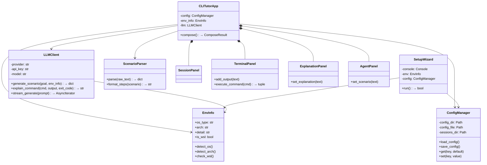
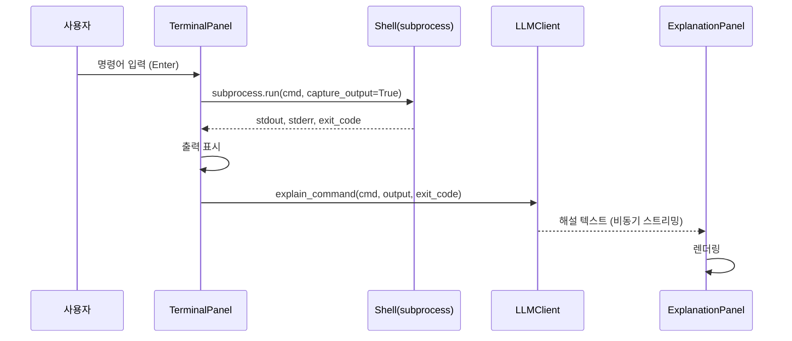
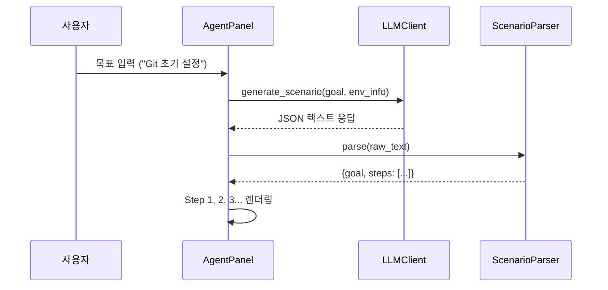

# CLI Tutor v1.0 — 제품 사양서 (Product Specification)

- **마지막 업데이트**: 2026-03-10 20:55
- **상태**: Stable (v1.2 Ready)

---

## 1. 제품 개요

> **"내 터미널 속의 마스터"** — CLI 환경의 공포를 없애고, 누구나 쉽게 시스템과 대화하는 방법을 학습하게 한다.

CLI Tutor는 **Textual(Python TUI 프레임워크)** 기반의 다중 LLM 연동 CLI 명령어 학습 및 에러 해설 도구입니다.

### 1.1 핵심 가치
| 가치 | 설명 |
| :--- | :--- |
| **가벼움** | Groq 무료 API 1순위, 로컬 설정 파일, pip 설치 |
| **친절함** | 사람의 언어로 직관적 해설, 에러 공포 제거 |
| **범용성** | Groq/Perplexity/Gemini 등 LLM 자유 교체 |
| **자립심** | 정답 지시가 아닌 방향 제안, 사용자가 직접 타이핑 |

---

## 2. 시스템 아키텍처

### 2.1 모듈 구성도

```
05_Product/
├── SPEC.md                    # 본 사양서
├── TODO.md                    # 개발 진행 체크리스트
├── requirements.txt           # Python 의존성
├── cli_tutor/                 # 메인 패키지
│   ├── __init__.py
│   ├── __main__.py            # 엔트리포인트 (python -m cli_tutor)
│   ├── app.py                 # TUI 메인 애플리케이션 (Textual App)
│   ├── app.tcss               # Textual CSS 스타일시트
│   ├── env_info.py            # 환경 감지 유닛 (OS/Arch/WSL)
│   ├── config_manager.py      # 설정 관리 유닛 (JSON 기반)
│   ├── setup_wizard.py        # 초기 설정 마법사 (Rich Console)
│   ├── llm_client.py          # Multi-LLM 추상 클라이언트
│   ├── scenario_parser.py     # JSON 시나리오 파서
│   └── panels/                # TUI 패널 위젯 모듈
│       ├── __init__.py
│       ├── session_panel.py   # 좌측 세션 패널
│       ├── terminal_panel.py  # 중앙 터미널 패널
│       ├── explanation_panel.py # 우측 상단 해설 패널
│       └── agent_panel.py     # 우측 하단 에이전트 패널
```

### 2.2 클래스 의존 관계



---

## 3. TUI 레이아웃 설계

### 3.1 4-Panel 구조 (ASCII 와이어프레임)

```
┌──────────┬───────────────────────────┬──────────────────────────┐
│ 세션목록  │     메인 터미널           │  우측 상단: 해설 패널    │
│          │  (명령어 입력/실행/출력)   │  · 방금 실행 명령 설명   │
│ [1] 기본  │                           │  · 성공/실패 판정       │
│ [2] Git   │  PS C:\> _                │  · 다음 명령 제안       │
│ [+새세션] │                           ├──────────────────────────┤
│          │                           │  우측 하단: 에이전트     │
│          │                           │  · 목표 → 시나리오      │
│          │                           │  · Step 1, 2, 3...      │
├──────────┴───────────────────────────┴──────────────────────────┤
│ [입력창] 명령어 또는 목표를 입력하세요... (Tab: 모드전환)        │
└─────────────────────────────────────────────────────────────────┘
```

### 3.2 Textual CSS Grid 정의

```css
Screen {
    layout: grid;
    grid-size: 3 2;
    grid-columns: 1fr 4fr 5fr; /* 세션(최소화) : 터미널 : 우측패널(가시성 확보) */
    grid-rows: 1fr 3;          /* 입력창 높이 3으로 고정 */
}

#sessions     { row-span: 1; }
#terminal     { row-span: 1; }
#right-pane   { row-span: 1; }
#input-bar    { column-span: 3; height: 3; }
```

---

## 4. 핵심 파이프라인

### 4.1 명령어 실행 파이프라인



### 4.2 시나리오 생성 파이프라인



### 4.3 입력 모드 전환

| 모드 | 트리거 | 동작 |
| :--- | :--- | :--- |
| **명령 모드** (기본) | 일반 Enter | 입력값을 OS 셸로 전달, 실행 후 해설 |
| **목표 모드** | Tab 전환 / `/goal` 접두사 | 입력값을 LLM 시나리오 생성으로 전달 |
| **설명 모드** | `/explain` 접두사 | 입력값에 대한 명령어 의미 질의 |

---

## 5. LLM 통합 전략

### 5.1 Provider 추상화

```python
# 공통 인터페이스 
class LLMClient:
    def generate_scenario(goal, env_info) -> dict   # 시나리오 JSON
    def explain_command(cmd, output, code) -> str    # 해설 텍스트
    def stream_generate(prompt) -> AsyncIterator     # 스트리밍
```

### 5.2 지원 LLM

| Provider | 모델 | 무료 티어 | 특징 |
| :--- | :--- | :--- | :--- |
| **Groq** (기본) | openai/gpt-oss-120b | RPM 30, 일 14,400 | 초고속, 무료 |
| **Perplexity** | sonar-small-online | 유료(옵션) | 웹 검색 통합 |
| **Gemini** | gemini-2.0-flash | 일 250 | 한국어 우수 |

### 5.3 프롬프트 전략

- **시나리오 생성**: OS 환경 컨텍스트 + JSON 출력 강제 + 2~5 스텝 제한
- **명령 해설**: 명령어 + 출력 + exit_code → 원인/해결책/다음 제안
- **설명 수준**: beginner(기본) / intermediate / advanced → 프롬프트 분기

---

## 6. 설정 관리

### 6.1 설정 파일 위치
- `~/.cli-tutor/config.json` (이전 `.g-tutor`에서 명칭 통일)

### 6.2 설정 스키마

```json
{
  "llm_provider": "groq",
  "llm_model": "openai/gpt-oss-120b",
  "groq_api_key": "gsk_...",
  "gemini_api_key": "",
  "perplexity_api_key": "",
  "explanation_level": "beginner",
  "safety_mode": "manual",
  "ui_theme": "dark"
}
```

### 6.3 초기 설정 플로우 (Setup Wizard)

```
프로그램 실행 → config.json 존재? 
  → No  → Setup Wizard (Rich Console)
           ├→ 시스템 정보 표시 (EnvInfo)
           ├→ LLM Provider 선택 (1: Groq / 2: Perplexity / 3: Gemini)
           ├→ API Key 입력
           └→ 설정 저장 & 요약 표시
  → Yes → TUI 메인 앱 실행
```

---

## 7. 안전 설계

| 기능 | 설명 |
| :--- | :--- |
| **위험 명령 경고** | `rm`, `sudo`, `del` 등 위험 패턴 감지 시 확인 프롬프트 |
| **민감 정보 마스킹** | API 키, 비밀번호, 토큰 등 LLM 전송 전 마스킹 |
| **복사/붙여넣기 가이드** | `Ctrl+C`에 의한 의도치 않은 종료를 방지하기 위해 매뉴얼에 명시적 가이드 제공 |
| **종료 키 이중화** | `Q`뿐만 아니라 `Ctrl+Q`를 공식 종료 키로 할당하여 혼동 최소화 |
| **롤백 힌트** | Git 관련 작업 시 되돌리기 명령어 함께 제시 |
| **모드 분리** | manual(기본): 사용자가 직접 실행 / semi-auto: 안전 명령만 자동 |

---

## 8. 향후 로드맵 및 우선순위 (Roadmap & Priorities)

### [P0] 필수 안정화 및 가시성 (v1.2) - ✅ 260310 20:55 완료
- **영구 로그 시스템**: `logs/` 폴더 기반 지속적 디버깅 및 노이즈 필터링 구축.
- **셸 전환 및 CD 보완**: `/shell` 명령어 및 `cd..` 등 특수 이동 로직 완비.
- **레이아웃 최적화**: 1:4:5 가변 그리드를 통한 우측 패널 가독성 극대화.

### [P1] UI/UX 고도화 (v1.3 예정 - 내일 작업)
- **스크롤 내비게이션**: 우측 패널 휠 스크롤 감도 개선 및 자동 추적(Auto-scroll) 강화.
- **포커스 인디케이터**: 위젯 전환 시 현재 위치를 명확히 보여주는 테두리 효과 보강.
- **실시간 스트리밍**: LLM 답변이 실시간으로 써지는 타이핑 효과 도입.
- **대화형(PTY) 지원**: `git commit`, `vim` 등 인터랙티브 모드 실행 연구.

### [P2] 플랫폼 확장 (v2.0)
- **커스텀 시나리오 샵**: 사용자 공유 시나리오 다운로드 및 관리.
- **멀티모달 튜터링**: 스크린샷 분석 기반 시각적 가이드.

### [P2] 플랫폼 확장 (v3.0)
- **커스텀 시나리오 샵**: 사용자가 직접 만든 JSON 시나리오를 공유하고 다운로드하는 광장.
- **멀티모달 튜터링**: 이미지(스크린샷) 분석을 통한 시각적 문제 해결 가이드.

---

## 9. 컴포넌트 구현 시퀀스

| 순서 | 모듈 | 설명 | 상태 |
| :--- | :--- | :--- | :--- |
| 1 | `env_info.py` | 환경 감지 | ✅ |
| 2 | `config_manager.py` | 설정 관리 | ✅ |
| 3 | `setup_wizard.py` | 초기 설정 마법사 | ✅ |
| 4 | `llm_client.py` | Multi-LLM 클라이언트 | ✅ |
| 5 | `logger.py` | 영구 로그 시스템 | ✅ |
| 6 | `panels/*` | 4개 TUI 패널 위젯 | ✅ |
| 7 | `app.py` | 메인 TUI 앱 조립 | ✅ |
| 8 | 통합 테스트 | 전체 플로우 검증 | 🛠️ |

---

## 10. AI 개발 보조 기술 (MCP & Skills 활용)

본 제품의 설계 및 구현 과정에서는 **Model Context Protocol (MCP)**의 지식과 **AI 전문가 가이드 (Skills)**를 결합하여 개발 속도와 품질을 동시에 확보했습니다.

### 10.1 내장 전문가 시스템 가이드 (Skills)
본 애플리케이션의 구조와 디자인은 아래의 사내 전문가 시스템 가이드라인을 엄격히 준수했습니다.
- **[Skills: Web Application Development]**: 
    - **핵심 원칙**: "Premium Designs & Visual Excellence" (단순 MVP를 넘어선 시각적 완성도).
    - **적용 사례**: 4-패널 그리드 배치, 동적 테두리 색상 변화, 로딩 인디케이터 등 풍부한 에스테틱(Aesthetics) 구현.
- **[Skills: Implementation Workflow]**:
    - **핵심 원칙**: "Plan and Understand" → "Build Foundation" → "Polish and Optimize" 5단계 워크플로우.
    - **적용 사례**: `SPEC.md`와 `TODO.md`를 우선 구축하고 모듈별로 점진적 구현 및 검증 진행.

### 10.2 활용된 MCP 서버 및 참조 지식 (MCP Context7)
`context7` MCP 서버를 통해 **[Textual(TUI)]** 및 **[Rich(Printing)]** 라이브러리의 최신 공식 가이드라인을 실시간 참조했습니다.

| 참조 Topic (Title) | 출처 (Source URL) | 본 프로젝트 적용 내용 |
| :--- | :--- | :--- |
| **Anatomy of a Textual User Interface** | [textual.textualize.io/blog/...](https://textual.textualize.io/blog/2024/09/15/anatomy-of-a-textual-user-interface) | `Input.Submitted` 이벤트 핸들링 및 `@on` 데코레이터 패턴 |
| **Widgets: Markdown Viewer** | [textual.textualize.io/widgets/...](https://textual.textualize.io/widgets/markdown_viewer) | LLM 응답을 비동기적으로 렌더링하기 위한 스트리밍 설계 기초 |
| **Widgets: RichLog / Rich Printing** | [textual.textualize.io/widgets/...](https://textual.textualize.io/widgets/rich_log) | 터미널 패널 내 `AnsiDecoder`와 `Rich.Text`를 이용한 출력 최적화 |

---

## 11. 오늘의 작업 요약 (2026-03-10)

1.  **디버깅 혁신**: 일일 로그 파일 시스템을 구축하고, 라이브러리 노이즈를 제거하여 "추적 가능한" 상태를 만들었습니다.
2.  **안전성 강화**: `cd..` 처리 오류와 `os` 임포트 누락 등 실행 중 발생하는 치명적 버그들을 전수 수리했습니다.
3.  **UI 최적화**: 1:4:5 가변 레이아웃을 도입하여 해설과 가이드가 잘리는 문제를 해결하고 우측 패널 가시성을 확보했습니다. (버전 v1.2 확보)

> [!TIP]
> **내일의 시작**: `terminal_panel.py`와 `app.tcss`에서 우측 패널의 스크롤 편의성과 포커스 전환 시각 효과 보강을 우선적으로 진행할 예정입니다.
### 10.3 기술적 결정 사유
- **비동기 워커 (`@work`)**: Textual 공식 가이드의 "Running long-running tasks" 설계 원칙에 따라, LLM API 호출(네트워크 I/O) 중에도 UI가 멈추지 않도록 비동기 전용 쓰레드를 할당했습니다.
- **모듈화 구조**: 전문가 가이드인 "Workflow"의 최신 권장 사항에 맞춰, 모든 패널을 별도 클래스로 캡슐화하여 확장성을 확보했습니다.

