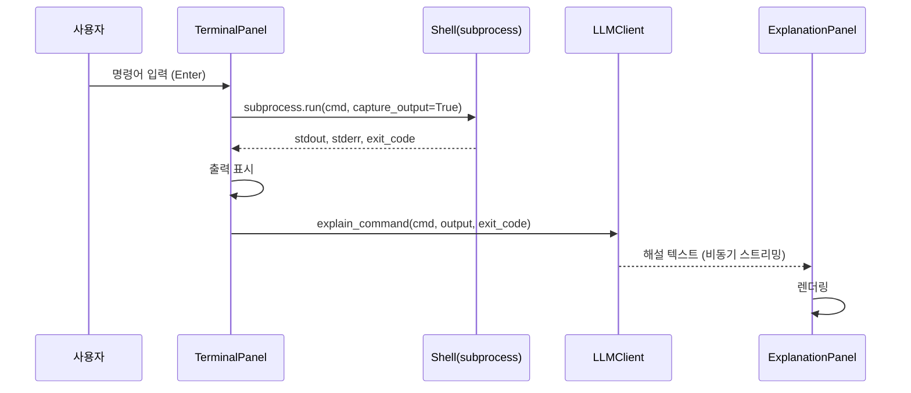
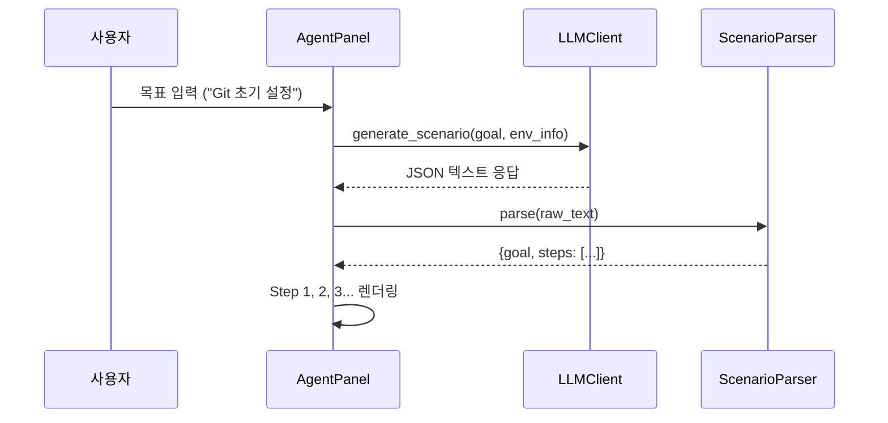

# CLI Tutor v1.0 — 제품 사양서 (Product Specification)

- **작성일**: 2026-03-10
- **작성자**: Anti & System Agent
- **상태**: In-Progress

---

## 1. 제품 개요

> **"내 터미널 속의 마스터"** — CLI 환경의 공포를 없애고, 누구나 쉽게 시스템과 대화하는 방법을 학습하게 한다.

CLI Tutor는 **Textual(Python TUI 프레임워크)** 기반의 다중 LLM 연동 CLI 명령어 학습 및 에러 해설 도구입니다.

### 1.1 핵심 가치
| 가치 | 설명 |
| :--- | :--- |
| **가벼움** | Groq 무료 API 1순위, 로컬 설정 파일, pip 설치 |
| **친절함** | 사람의 언어로 직관적 해설, 에러 공포 제거 |
| **범용성** | Groq/Perplexity/Gemini 등 LLM 자유 교체 |
| **자립심** | 정답 지시가 아닌 방향 제안, 사용자가 직접 타이핑 |

---

## 2. 시스템 아키텍처

### 2.1 모듈 구성도

```
05_Product/
├── SPEC.md                    # 본 사양서
├── TODO.md                    # 개발 진행 체크리스트
├── requirements.txt           # Python 의존성
├── cli_tutor/                 # 메인 패키지
│   ├── __init__.py
│   ├── __main__.py            # 엔트리포인트 (python -m cli_tutor)
│   ├── app.py                 # TUI 메인 애플리케이션 (Textual App)
│   ├── app.tcss               # Textual CSS 스타일시트
│   ├── env_info.py            # 환경 감지 유닛 (OS/Arch/WSL)
│   ├── config_manager.py      # 설정 관리 유닛 (JSON 기반)
│   ├── setup_wizard.py        # 초기 설정 마법사 (Rich Console)
│   ├── llm_client.py          # Multi-LLM 추상 클라이언트
│   ├── scenario_parser.py     # JSON 시나리오 파서
│   └── panels/                # TUI 패널 위젯 모듈
│       ├── __init__.py
│       ├── session_panel.py   # 좌측 세션 패널
│       ├── terminal_panel.py  # 중앙 터미널 패널
│       ├── explanation_panel.py # 우측 상단 해설 패널
│       └── agent_panel.py     # 우측 하단 에이전트 패널
```

### 2.2 클래스 의존 관계


---

## 3. TUI 레이아웃 설계

### 3.1 4-Panel 구조 (ASCII 와이어프레임)

```
┌──────────┬───────────────────────────┬──────────────────────────┐
│ 세션목록  │     메인 터미널           │  우측 상단: 해설 패널    │
│          │  (명령어 입력/실행/출력)   │  · 방금 실행 명령 설명   │
│ [1] 기본  │                           │  · 성공/실패 판정       │
│ [2] Git   │  PS C:\> _                │  · 다음 명령 제안       │
│ [+새세션] │                           ├──────────────────────────┤
│          │                           │  우측 하단: 에이전트     │
│          │                           │  · 목표 → 시나리오      │
│          │                           │  · Step 1, 2, 3...      │
├──────────┴───────────────────────────┴──────────────────────────┤
│ [입력창] 명령어 또는 목표를 입력하세요... (Tab: 모드전환)        │
└─────────────────────────────────────────────────────────────────┘
```

### 3.2 Textual CSS Grid 정의

```css
Screen {
    layout: grid;
    grid-size: 3 2;
    grid-columns: 15 1fr 1fr;
    grid-rows: 1fr auto;
}

#sessions     { row-span: 1; }
#terminal     { row-span: 1; }
#right-pane   { row-span: 1; }
#input-bar    { column-span: 3; height: 3; }
```

---

## 4. 핵심 파이프라인

### 4.1 명령어 실행 파이프라인



### 4.2 시나리오 생성 파이프라인



### 4.3 입력 모드 전환

| 모드 | 트리거 | 동작 |
| :--- | :--- | :--- |
| **명령 모드** (기본) | 일반 Enter | 입력값을 OS 셸로 전달, 실행 후 해설 |
| **목표 모드** | Tab 전환 / `/goal` 접두사 | 입력값을 LLM 시나리오 생성으로 전달 |
| **설명 모드** | `/explain` 접두사 | 입력값에 대한 명령어 의미 질의 |

---

## 5. LLM 통합 전략

### 5.1 Provider 추상화

```python
# 공통 인터페이스 
class LLMClient:
    def generate_scenario(goal, env_info) -> dict   # 시나리오 JSON
    def explain_command(cmd, output, code) -> str    # 해설 텍스트
    def stream_generate(prompt) -> AsyncIterator     # 스트리밍
```

### 5.2 지원 LLM

| Provider | 모델 | 무료 티어 | 특징 |
| :--- | :--- | :--- | :--- |
| **Groq** (기본) | openai/gpt-oss-120b | RPM 30, 일 14,400 | 초고속, 무료 |
| **Perplexity** | sonar-small-online | 유료(옵션) | 웹 검색 통합 |
| **Gemini** | gemini-2.0-flash | 일 250 | 한국어 우수 |

### 5.3 프롬프트 전략

- **시나리오 생성**: OS 환경 컨텍스트 + JSON 출력 강제 + 2~5 스텝 제한
- **명령 해설**: 명령어 + 출력 + exit_code → 원인/해결책/다음 제안
- **설명 수준**: beginner(기본) / intermediate / advanced → 프롬프트 분기

---

## 6. 설정 관리

### 6.1 설정 파일 위치
- `~/.cli-tutor/config.json` (이전 `.g-tutor`에서 명칭 통일)

### 6.2 설정 스키마

```json
{
  "llm_provider": "groq",
  "llm_model": "openai/gpt-oss-120b",
  "groq_api_key": "gsk_...",
  "gemini_api_key": "",
  "perplexity_api_key": "",
  "explanation_level": "beginner",
  "safety_mode": "manual",
  "ui_theme": "dark"
}
```

### 6.3 초기 설정 플로우 (Setup Wizard)

```
프로그램 실행 → config.json 존재? 
  → No  → Setup Wizard (Rich Console)
           ├→ 시스템 정보 표시 (EnvInfo)
           ├→ LLM Provider 선택 (1: Groq / 2: Perplexity / 3: Gemini)
           ├→ API Key 입력
           └→ 설정 저장 & 요약 표시
  → Yes → TUI 메인 앱 실행
```

---

## 7. 안전 설계

| 기능 | 설명 |
| :--- | :--- |
| **위험 명령 경고** | `rm`, `sudo`, `del` 등 위험 패턴 감지 시 확인 프롬프트 |
| **민감 정보 마스킹** | API 키, 비밀번호, 토큰 등 LLM 전송 전 마스킹 |
| **롤백 힌트** | Git 관련 작업 시 되돌리기 명령어 함께 제시 |
| **모드 분리** | manual(기본): 사용자가 직접 실행 / semi-auto: 안전 명령만 자동 |

---

## 8. 기술 스택

| 구분 | 기술 | 버전 |
| :--- | :--- | :--- |
| 언어 | Python | 3.9+ |
| TUI 프레임워크 | Textual | 0.40+ |
| 텍스트 스타일링 | Rich | 13.0+ |
| HTTP 클라이언트 | httpx | 0.25+ |
| LLM (기본) | groq | 최신 |
| LLM (옵션) | google-generativeai, openai | 최신 |
| 셸 실행 | subprocess (표준) | - |

---

## 9. 구현 우선순위

| 순서 | 모듈 | 설명 | 상태 |
| :--- | :--- | :--- | :--- |
| 1 | `env_info.py` | 환경 감지 | 🔲 |
| 2 | `config_manager.py` | 설정 관리 | 🔲 |
| 3 | `setup_wizard.py` | 초기 설정 마법사 | 🔲 |
| 4 | `llm_client.py` | Multi-LLM 클라이언트 | 🔲 |
| 5 | `scenario_parser.py` | 시나리오 파서 | 🔲 |
| 6 | `panels/*` | 4개 TUI 패널 위젯 | 🔲 |
| 7 | `app.tcss` | Textual CSS 스타일 | 🔲 |
| 8 | `app.py` | 메인 TUI 앱 조립 | 🔲 |
| 9 | `__main__.py` | 엔트리포인트 | 🔲 |
| 10 | 통합 테스트 | 전체 플로우 검증 | 🔲 |
